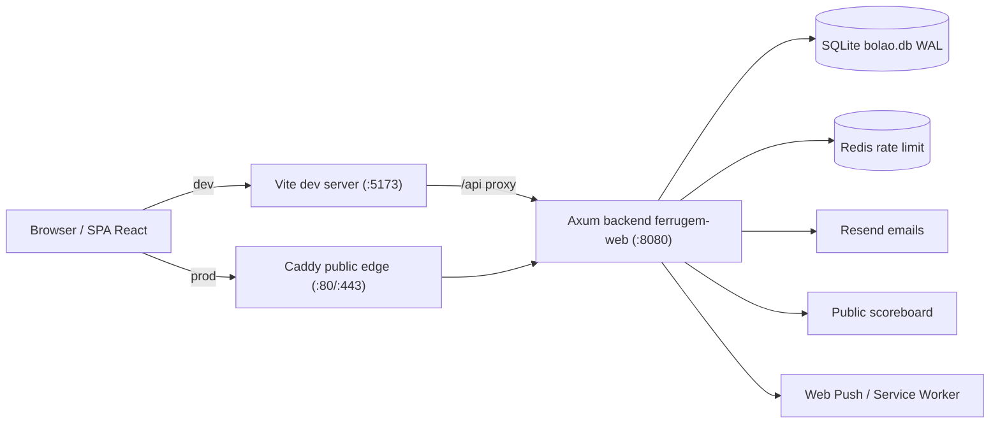

# Documento Técnico do Presumidos

Data de referencia: 2026-08-22

## 1. Objetivo

Este documento descreve a arquitetura, os componentes principais, o banco de dados, a infraestrutura de
execucao, as variaveis de ambiente e os fluxos operacionais do projeto Presumidos.

O foco aqui e engenharia de software: como o sistema e organizado, como os modulos se comunicam, quais
convenções de seguranca existem e como o deploy se sustenta em desenvolvimento e producao.

## 2. Resumo Executivo

O Presumidos e uma aplicacao de bolao da Copa do Mundo FIFA 2026 composta por:

- backend Rust com Axum expondo API REST/JSON;
- frontend SPA React com Vite, TypeScript e Tailwind;
- banco SQLite com WAL;
- Redis para rate limit em producao;
- Caddy como borda publica e reverse proxy;
- Resend para emails transacionais;
- integracao com scoreboard publico para resultados ao vivo;
- worker de notificacoes web push;
- scripts de backup e restore para o SQLite.

O repositório atual reflete uma migracao de uma arquitetura fullstack antiga para o modelo atual:
API Rust desacoplada + SPA React. O nome do crate `ferrugem-web` permanece por legado historico.

## 3. Arquitetura Geral



### 3.1 Fluxo de acesso em desenvolvimento

- O frontend sobe com Vite em `:5173`.
- O Vite faz proxy de `/api` para o backend em `:8080`.
- O cookie de sessão funciona como same-origin via proxy, sem CORS.

### 3.2 Fluxo de acesso em producao

- A Internet chega somente ao Caddy em `:80` e `:443`.
- O Caddy faz reverse proxy para `ferrugem-web:8080`.
- O backend serve a API e tambem os estaticos compilados da SPA.
- Redis fica interno para rate limit persistente.

## 4. Estrutura do Repositorio

```text
.
├── Cargo.toml
├── Cargo.lock
├── Dockerfile
├── docker-compose.yml
├── deploy/
├── ferrugem-web/
│   ├── migrations/
│   └── src/
├── scripts/
├── web/
│   └── src/
├── .env
├── .env.example
└── README.md
```

O workspace Rust possui apenas um membro, `ferrugem-web`.

## 5. Backend Rust

### 5.1 Workspace e features

O backend vive em `ferrugem-web/` e usa:

- Rust 2021;
- Axum para HTTP;
- SQLx para SQLite;
- reqwest para o provedor de placares;
- Redis para rate limit em producao;
- Resend para emails transacionais;
- web-push para notificacoes no navegador.

O crate tem:

- feature default `server`;
- feature opcional `web-push`.

Em producao, o Docker build habilita `server,web-push`.

### 5.2 Ponto de entrada

O arquivo `ferrugem-web/src/main.rs` faz o bootstrap completo:

- inicializa o banco;
- executa housekeeping;
- sobe o poller de resultados ao vivo, se habilitado;
- sobe o worker de web push, se habilitado;
- serve `/api` e os estaticos da SPA;
- expõe comandos CLI para operacao.

Os comandos principais sao:

- `bootstrap-admin`
- `sync-fixtures`
- `cleanup-expired`
- `backfill-results`

### 5.3 Camada HTTP

`ferrugem-web/src/api.rs` e a borda HTTP/JSON.

Ela:

- le headers e bodies;
- chama a logica de negocio;
- converte `ServerFnError` em resposta HTTP;
- aplica contexto de request por middleware;
- acumula headers de resposta, incluindo cookies.

#### Grupos de rotas principais

| Grupo | Exemplos de rotas |
| --- | --- |
| Saude e info | `GET /api/health`, `GET /api/contact`, `GET /api/settings/public` |
| Auth | `POST /api/auth/register`, `POST /api/auth/login`, `POST /api/auth/logout`, `GET /api/auth/current-user`, `GET /api/auth/csrf`, `POST /api/auth/reauth` |
| Notificacoes | `GET /api/notifications/status`, `POST /api/notifications/preferences`, `POST /api/notifications/subscriptions` |
| Boloes | `GET /api/pools`, `POST /api/pools`, `POST /api/pools/join`, `GET /api/pools/{pool_id}/member-predictions` |
| Partidas | `GET /api/matches`, `GET /api/matches/knockout-released`, `POST /api/predictions` |
| Ranking | `GET /api/scoring/my-points`, `GET /api/leaderboard` |
| Admin | `GET /api/admin/overview`, `GET /api/admin/matches`, `POST /api/admin/matches/{id}/result`, `POST /api/admin/settings` e demais rotas operacionais |

### 5.4 Modulos de negocio

#### `auth.rs`

Responsavel por:

- cadastro com verificacao por email;
- confirmacao de cadastro por codigo;
- login com Argon2id;
- reset de senha;
- logout;
- sessao via cookie HttpOnly;
- CSRF;
- bootstrap do primeiro admin;
- confirmacao recente de senha de admin para acoes sensiveis.

Regras importantes:

- o primeiro admin e criado apenas por CLI;
- o bootstrap falha se ja existir admin;
- codigos de email expiram em 15 minutos;
- o numero de tentativas de codigo e limitado;
- o backend invalida sessoes antigas ao alterar senha.

#### `pools.rs`

Responsavel por:

- criar boloes;
- entrar por codigo de convite;
- listar boloes do usuario;
- listar palpites visiveis de membros;
- reagir a palpites com emojis;
- ajustes manuais de pontos;
- exclusao de bolao;
- administracao de membros.

Regra relevante:

- um usuario so ve palpites de partidas que ja comecaram e apenas se a partida iniciou depois de sua entrada no bolao.

#### `matches.rs`

Responsavel por:

- listar partidas;
- receber palpites do usuario;
- salvar resultado oficial;
- liberar o mata-mata;
- editar equipes e calendario;
- cadastrar partidas manuais de mata-mata;
- apagar partidas;
- mapear fixtures externos.

Regras importantes:

- palpites travam apos o kickoff;
- o mata-mata pode ficar oculto ate o admin liberar;
- em empate no mata-mata, o classificado e deduzido pelo placar ou pelos penaltis, nao por um seletor livre;
- o resultado manual do admin e soberano frente ao poller.

#### `scoring.rs`

Responsavel pelo calculo do ranking.

Regras atuais:

- placar exato: 7 pontos;
- resultado correto com um dos lados exatamente correto e gols positivos: 4 pontos;
- resultado correto: 3 pontos;
- erro de resultado: 0;
- bonus de mata-mata: ate 3 pontos adicionais quando houver penaltis.

O ranking tambem:

- considera elegibilidade por data de entrada no bolao;
- agrega overlay de placar ao vivo para partidas em andamento;
- aplica ajustes manuais de pontos;
- desempata por placares exatos, resultados corretos, bonus e username.

#### `football.rs`

Responsavel pela integracao de placares ao vivo.

Ele:

- consulta um scoreboard publico;
- classifica eventos como ao vivo, fase de grupos finalizada, mata-mata finalizado ou ignorado;
- atualiza live score no banco;
- finaliza automaticamente jogos de grupo;
- sugere ou finaliza jogos de mata-mata quando ha coerencia suficiente;
- respeita resultado manual ja publicado;
- mapeia partidas locais para IDs externos via `sync-fixtures`.

#### `push.rs`

Responsavel por notificacoes web push:

- cadastro e remocao de subscriptions;
- preferencia de notificacao por usuario;
- worker de lembrete antes do jogo;
- envio de push para reacoes e mensagens administrativas;
- limpeza de subscriptions inativas.

#### `email.rs`

Responsavel por emails transacionais via Resend:

- confirmacao de cadastro;
- reset de senha.

Em desenvolvimento, se `DEV_DISABLE_AUTH_EMAILS=true`, os codigos sao impressos no terminal.

#### `admin.rs`

E o console operacional do sistema.

Cobertura principal:

- resumo operacional;
- listagem e edicao de partidas;
- auditoria;
- recalculate scoring;
- usuarios;
- boloes;
- sync status;
- settings globais;
- bloqueio e desbloqueio de usuarios;
- invalida sessao;
- disparo de push;
- reabertura de palpites;
- liberar e configurar final/mata-mata.

### 5.5 Seguranca

O backend implementa um modelo de seguranca bem coerente:

- cookie de sessao HttpOnly;
- CSRF em mutacoes;
- SameSite=Lax;
- headers de seguranca por resposta;
- rate limit com backends `memory` e `redis`;
- resolucao de IP somente quando o proxy remoto e confiavel;
- `REQUIRE_TRUSTED_PROXY=true` em producao;
- confirmacao recente de senha para operacoes de admin;
- trilha de auditoria em `audit_logs`.

### 5.6 Configuracao e validacao de ambiente

`ferrugem-web/src/config.rs` carrega `.env` e valida invariantes logo no boot.

Principais validacoes:

- `SESSION_SECRET` com pelo menos 32 caracteres;
- `RATE_LIMIT_IDENTITY_SECRET` com pelo menos 32 caracteres;
- `COOKIE_SECURE=true` em producao;
- `RATE_LIMIT_BACKEND=redis` em producao;
- `REDIS_URL` presente quando o backend de rate limit e redis;
- `TRUSTED_PROXY_CIDRS` coerente quando o proxy e obrigatorio;
- `RESEND_API_KEY` e `RESEND_FROM_EMAIL` quando emails estiverem ativos;
- `FOOTBALL_API_BASE_URL` e intervalos validos quando a integracao ao vivo esta habilitada;
- VAPID keys e email de contato quando o web push esta habilitado.

## 6. Frontend SPA

### 6.1 Stack

O frontend usa:

- React 18;
- TypeScript;
- Vite;
- Tailwind CSS;
- TanStack Query;
- React Router;
- Framer Motion;
- Lucide icons;
- Tailwind merge e class-variance-authority.

### 6.2 Boot da aplicacao

`web/src/main.tsx` faz:

- `ThemeProvider`;
- `QueryClientProvider`;
- registro do service worker;
- renderizacao da `App`.

### 6.3 Cliente de API e auth

`web/src/lib/api.ts`:

- usa `/api` como base;
- envia cookie de sessao em todas as requisicoes;
- anexa `X-CSRF-Token` nas mutacoes;
- renova CSRF automaticamente se houver dessincronizacao;
- trata reautenticacao de admin como caso separado.

`web/src/hooks/useAuth.tsx`:

- mantem a sessao em cache;
- expõe `user`, `csrfToken`, `isAdmin`, `applySession` e `logout`;
- faz a query `current-user` com `staleTime` curto.

### 6.4 Layout e tema

`web/src/components/Layout.tsx`:

- carrega settings publicas;
- mostra banner global se habilitado;
- aplica a classe `final-theme` quando `final_theme_enabled` esta ativo.

O sistema tem um tema visual da final, mas nao ha uma tela de encerramento separada neste checkout.

### 6.5 Rotas e paginas

Rotas principais:

- `/` home;
- `/login`;
- `/register`;
- `/forgot-password`;
- `/terms`;
- `/privacy`;
- `/contact`;
- `/dashboard`;
- `/predictions`;
- `/palpites-do-bolao`;
- `/leaderboard`;
- `/admin`;
- `/conta`.

Paginas observadas em `web/src/pages`:

- `Home.tsx`
- `Dashboard.tsx`
- `Predictions.tsx`
- `PoolPredictions.tsx`
- `Leaderboard.tsx`
- `Admin.tsx`
- `Conta.tsx`
- `Login.tsx`
- `Register.tsx`
- `ForgotPassword.tsx`
- `Contact.tsx`
- `Terms.tsx`
- `Privacy.tsx`

### 6.6 Experiencia de uso

O frontend foi desenhado com foco mobile-first e usa:

- navegação com menu responsivo;
- animações sutis;
- destaque de jogos ao vivo na home;
- banner de lembrete de notificacoes;
- formulários compactos;
- foco em poucos cliques para palpitar e administrar.

## 7. Banco de Dados e Migrations

### 7.1 Motor e estrategia

- SQLite em arquivo local (`DATABASE_PATH`);
- journal mode WAL;
- busy timeout para concorrencia leve;
- migrations versionadas em `ferrugem-web/migrations`.

### 7.2 Tabelas principais

- `users`
- `sessions`
- `pools`
- `pool_members`
- `matches`
- `predictions`
- `app_settings`
- `audit_logs`
- `point_adjustments`
- `pending_registrations`
- `password_reset_codes`
- `notification_preferences`
- `push_subscriptions`
- `push_reminder_deliveries`
- `prediction_reactions`
- `prediction_reaction_views`
- `prediction_admin_overrides`
- `scoring_jobs`
- `prediction_score_breakdowns`
- `sync_runs`

### 7.3 Evolucao do schema

| Migration | Finalidade |
| --- | --- |
| `0001_init.sql` | esquema inicial de usuarios, sessoes, boloes, partidas e palpites |
| `0002_seed_matches.sql` | seed inicial das partidas |
| `0003_real_schedule.sql` | agenda oficial com 104 jogos e fases |
| `0004_phase_release.sql` | flag de liberacao do mata-mata |
| `0005_scoring_knockout.sql` | colunas de mata-mata em partidas e palpites |
| `0006_security_hardening.sql` | CSRF, reauth de admin e audit log |
| `0007_email_codes.sql` | registros de verificacao e reset de senha |
| `0008_match_finished.sql` | flag `finished` em partidas |
| `0009_point_adjustments.sql` | ajustes manuais de pontos |
| `0010_live_scores.sql` | placar ao vivo e origem externa do resultado |
| `0011_web_push.sql` | preferencias, subscriptions e entregas push |
| `0012_admin_console.sql` | overrides, scoring jobs, sync runs e settings administrativos |
| `0013_prediction_reactions.sql` | reacoes em palpites e seen-state |
| `0014_clear_seeded_knockout.sql` | remove seeds de mata-mata para cadastro manual |
| `0015_knockout_autofill.sql` | campos de sugestao automatica do mata-mata |
| `0016_clear_manual_source_for_pending_knockout.sql` | ajusta source para sugestoes pendentes |
| `0017_final_theme.sql` | ativa o tema visual da final via `app_settings` |

### 7.4 Settings relevantes

`app_settings` e o ponto de configuracao operacional do dominio.

Chaves observadas:

- `knockout_released`
- `auto_sync_enabled`
- `sync_interval_minutes`
- `prediction_lock_minutes`
- `global_banner_enabled`
- `global_banner_text`
- `final_theme_enabled`

Essas configuracoes alimentam o frontend via `/api/settings/public` e o painel admin via `/api/admin/settings`.

## 8. Fluxos Operacionais

### 8.1 Desenvolvimento local

Backend:

```bash
cargo run -p ferrugem-web --features server
```

Frontend:

```bash
cd web
npm install
npm run dev
```

### 8.2 Bootstrap do primeiro admin

O primeiro admin e criado via CLI, nunca por rota publica.

Fluxo:

1. subir banco e app com `.env`;
2. rodar `bootstrap-admin`;
3. confirmar a criacao;
4. rotacionar ou remover `ADMIN_BOOTSTRAP_SECRET`.

### 8.3 Sincronizacao de fixtures

O mapeamento entre `jogo-001..jogo-104` e os IDs externos e feito uma vez por CLI.

Modos:

- `--dry-run`
- `--apply`
- `--fixture jogo-XXX=ID`

### 8.4 Housekeeping

Na inicializacao, o backend limpa:

- sessoes expiradas;
- cadastros pendentes vencidos;
- codigos de reset vencidos;
- subscriptions push inativas;
- entregas antigas de push.

### 8.5 Backup e restore

O banco fica no volume Docker `app_data` e os scripts de backup/restore operam sobre o SQLite com seguranca.

Ferramentas disponiveis:

- `deploy/backup.sh`
- `deploy/restore.sh`
- `deploy/restore-test.sh`
- `deploy/maintenance.sh`

### 8.6 Leitura de placares ao vivo

O poller:

- roda em background;
- consulta o scoreboard publico;
- usa intervalo base e intervalo reduzido em janela de jogo;
- adiciona jitter para reduzir padrao fixo;
- respeita o resultado manual quando ja existe.

### 8.7 Notificacoes web push

O fluxo de push envolve:

- service worker em `/sw.js`;
- subscription do browser;
- persistencia da subscription no backend;
- lembretes antes do jogo;
- preferencias por usuario.

## 9. Docker, Compose e Borda Publica

### 9.1 Dockerfile

O [Dockerfile](./Dockerfile) compoe tres fases:

1. frontend Node builda a SPA;
2. backend Rust compila o binario com `cargo-chef`;
3. runtime Debian slim leva binario + estaticos.

Observacao:

- o README menciona Node 18+ como pre-requisito de desenvolvimento;
- o build de producao no Dockerfile usa Node 22-alpine.

### 9.2 docker-compose

Os servicos principais sao:

- `ferrugem-web`
- `redis`
- `caddy`

Os servicos auxiliares de operacao sao:

- `backup`
- `sqlite-tool`

Topologia:

- `ferrugem-web` exposto apenas internamente;
- `redis` interno;
- `caddy` e o unico publicado em `80` e `443`.

### 9.3 Caddy

O Caddy:

- aplica compressao;
- faz reverse proxy;
- injeta headers de origem;
- remove `CF-Connecting-IP` vindo do cliente;
- suporta pagina de manutencao via arquivo-flag.

## 10. Variaveis de Ambiente

### 10.1 Base

- `APP_ENV`
- `APP_DOMAIN`
- `DATABASE_PATH`

### 10.2 Sessao e seguranca

- `SESSION_SECRET`
- `ADMIN_BOOTSTRAP_SECRET`
- `SESSION_TTL_HOURS`
- `COOKIE_SECURE`
- `ADMIN_REAUTH_TTL_MINUTES`
- `TRUSTED_PROXY_CIDRS`
- `REQUIRE_TRUSTED_PROXY`
- `RATE_LIMIT_BACKEND`
- `REDIS_URL`
- `RATE_LIMIT_IDENTITY_SECRET`

### 10.3 Argon2

- `ARGON2_MEMORY_KIB`
- `ARGON2_TIME_COST`
- `ARGON2_PARALLELISM`
- `ARGON2_POLICY_VERSION`

### 10.4 Emails

- `DEV_DISABLE_AUTH_EMAILS`
- `RESEND_API_KEY`
- `RESEND_FROM_EMAIL`
- `CONTACT_EMAIL`
- `VITE_CONTACT_EMAIL`

### 10.5 Integracao de placares

- `FOOTBALL_API_ENABLED`
- `FOOTBALL_POLLER_ENABLED`
- `FOOTBALL_API_BASE_URL`
- `FOOTBALL_POLL_INTERVAL_SECS`
- `FOOTBALL_LIVE_POLL_INTERVAL_SECS`

### 10.6 Web push

- `WEB_PUSH_ENABLED`
- `WEB_PUSH_POLL_INTERVAL_SECS`
- `WEB_PUSH_VAPID_PUBLIC_KEY`
- `WEB_PUSH_VAPID_PRIVATE_KEY`
- `WEB_PUSH_CONTACT_EMAIL`

### 10.7 Observacao importante

O arquivo `.env` do checkout contem segredos reais e valores de dev. Este documento nao os reproduz.

## 11. Pontos de Atencao

- O sistema tem um contrato forte entre Rust models e tipos TypeScript; existe risco de drift se um lado mudar sem o outro.
- O checkout atual tem `final_theme_enabled`, mas nao tem uma tela `CupClosing` versionada.
- O `closing_screen` nao aparece nas migracoes nem nas paginas atuais do SPA.
- O projeto depende de um proxy confiavel em producao; configurar `REQUIRE_TRUSTED_PROXY` errado quebra auth e rate limit.
- O scoreboard publico e uma dependencia externa sem chave, entao a estabilidade depende da disponibilidade da fonte.
- O leaderboard mistura score materializado, overlay ao vivo e ajustes manuais, entao a leitura de ranking precisa considerar os tres planos ao mesmo tempo.

## 12. Referencias Rapidas de Codigo

- `ferrugem-web/src/main.rs`
- `ferrugem-web/src/api.rs`
- `ferrugem-web/src/auth.rs`
- `ferrugem-web/src/pools.rs`
- `ferrugem-web/src/matches.rs`
- `ferrugem-web/src/scoring.rs`
- `ferrugem-web/src/football.rs`
- `ferrugem-web/src/push.rs`
- `ferrugem-web/src/email.rs`
- `ferrugem-web/src/admin.rs`
- `ferrugem-web/src/config.rs`
- `ferrugem-web/src/db.rs`
- `web/src/App.tsx`
- `web/src/main.tsx`
- `web/src/hooks/useAuth.tsx`
- `web/src/hooks/queries.ts`
- `web/src/components/Layout.tsx`
- `web/src/pages/Admin.tsx`
- `docker-compose.yml`
- `Dockerfile`
- `deploy/Caddyfile`

## 13. Conclusao

O Presumidos esta bem estruturado para um produto pequeno-medio com exigencias reais de operacao.
A separacao entre dominio, API, frontend e infraestrutura e clara, e as regras mais sensiveis
estao protegidas por validacao de config, CSRF, rate limit, auditoria e reautenticacao de admin.

Os principais pontos fortes sao:

- simplicidade operacional com SQLite + WAL;
- contrato de API claro;
- deploy em container com borda bem definida;
- regras de negocio concentradas no backend;
- suporte a placar ao vivo, push e auditoria.

Os principais pontos de cuidado sao:

- sincronizacao manual entre Rust e TypeScript;
- dependencia de fonte externa de placar;
- ausencia de uma tela de encerramento separada no checkout atual;
- necessidade de proxy confiavel corretamente configurado em producao.
